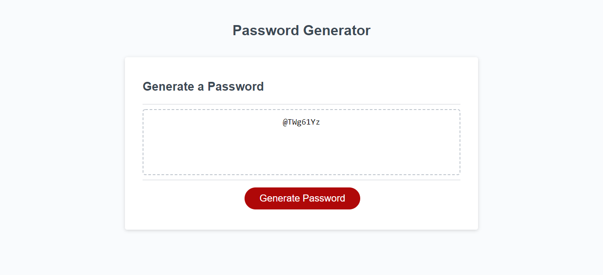

# 03-password-generator
Bootcamp Homework #3

## Objective

Created a password generator that allows user to select a number of characters and character types and returns a randomly generated password using chosen criteria. 

## Screen Shot

## Link to deployed page

[Here is the link to my deployed code.](https://ljhofer.github.io/03-password-generator/)